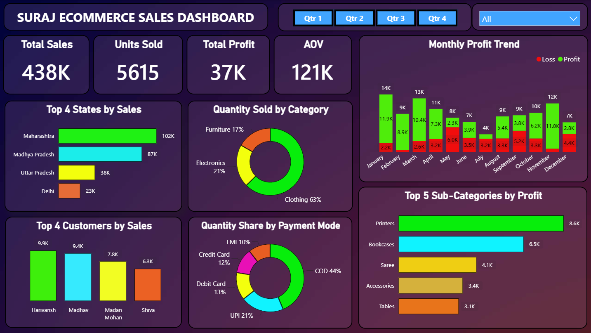

# Retail Sales & Profit Analysis — Power BI Dashboard

An interactive Power BI dashboard analyzing retail sales, profitability, and customer behavior using order-level transaction data.

## 📌 Overview

This project analyzes 500 orders (1,500 line items) of retail transaction data to uncover trends in sales, profit, product categories, payment preferences, and regional performance across India.

## 🎯 Objective

- Track overall sales performance and profitability (KPIs: Total Sales, Total Profit, Units Sold, AOV)
- Identify top-performing states, customers, and sub-categories
- Analyze monthly profit trends across the year
- Understand payment mode preferences and category-wise quantity share
- Flag loss-making transactions for further business review

## 🗂️ Dataset

| File | Description | Rows |
|------|-------------|------|
| `Orders.csv` | Order ID, Order Date, Customer Name, State, City | 500 |
| `Details.csv` | Order ID, Amount, Profit, Quantity, Category, Sub-Category, Payment Mode | 1,500 |

Both files are linked on `Order ID` (one order can contain multiple product line items).

## 📊 Dashboard Features

- **KPI Cards:** Total Sales, Units Sold, Total Profit, Average Order Value (AOV)
- **Monthly Profit Trend** — column chart showing profit seasonality
- **Top 5 Sub-Categories by Profit** — bar chart
- **Top 4 States by Sales** — bar chart
- **Top 4 Customers by Sales** — column chart
- **Quantity Sold by Category** — donut chart
- **Quantity Share by Payment Mode** — donut chart
- **Slicers:** Filter by Quarter and State

## 🔑 Key Insights

- Total Sales: **₹4,37,771** | Total Profit: **₹36,963** (≈8.4% margin)
- **Electronics** generates the highest revenue, but **Clothing** has a comparatively stronger profit margin
- **Maharashtra** and **Madhya Pradesh** are the top revenue-generating states
- **Cash on Delivery (COD)** is the most preferred payment mode, followed by UPI
- **Printers** and **Bookcases** are the most profitable sub-categories
- A notable share of line items show negative profit, highlighting an area for pricing/discount review

## 🛠️ Tools Used

- **Power BI Desktop** — data modeling, DAX measures, dashboard design
- **Power Query** — data cleaning and transformation
- **DAX** — calculated measures (AOV, Profit Margin, etc.)

## 📂 Repository Structure

```
├── Dashboard.pbix       # Power BI dashboard file
├── Orders.csv           # Raw orders data
├── Details.csv          # Raw order details data
└── README.md            # Project documentation
```

---

## 🖼️ Dashboard Preview



---

## 🚀 How to Use

1. Clone this repository
2. Open `Dashboard.pbix` in Power BI Desktop
3. Use the Quarter/State slicers to explore the data interactively

## 👤 Author

**Satyam Kumar Singh**
Data Analytics Enthusiast | Python • SQL • Power BI • Excel
